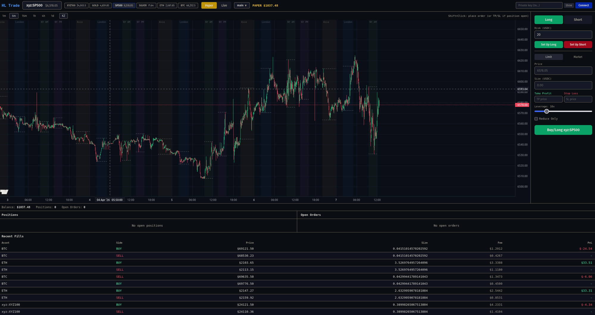

# HL Trade

A fast, keyboard-driven trading frontend for [Hyperliquid](https://hyperliquid.xyz) with built-in paper trading and chart-based order entry.



## Features

- **Paper trading engine** — practice with simulated fills, margin, and PnL tracking before going live
- **Chart-based order entry** — shift+click to place limit orders or set TP/SL directly on the chart
- **ICT killzone overlays** — session highlights (Asia, London, NY) with DST-aware timing
- **Risk-first order panel** — set risk in USD, leverage, TP/SL, and let the UI calculate size
- **Multi-asset tabs** — quickly switch between BTC, ETH, S&P 500, Gold, Silver, and more
- **Private key wallet** — connect with a private key for direct on-chain execution

## Quick Start

```bash
git clone https://github.com/YOUR_USER/hl-frontend.git
cd hl-frontend
npm install
npm run dev
```

Open `http://localhost:5173` and connect a wallet or switch to Paper mode to start trading.

## Tech Stack

React, TypeScript, Vite, Zustand, [Lightweight Charts](https://github.com/nicehash/lightweight-charts)
